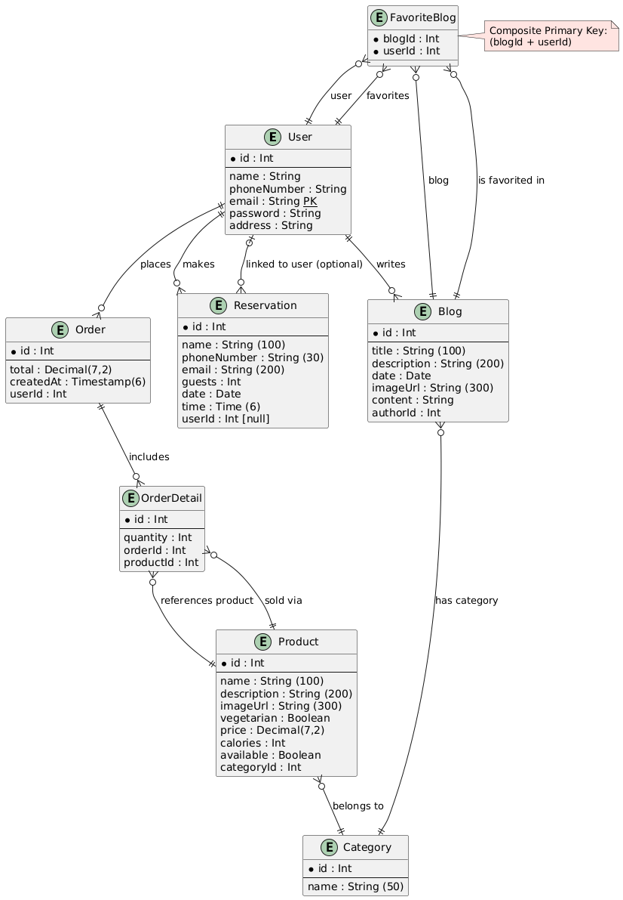

## 1. Estructura del proyecto
El proyecto está organizado en varias carpetas que separan claramente las responsabilidades de cada parte del desarrollo. Esta organización permite una fácil navegación y mantenimiento del código.
Carpetas Principales
- `backend/`  
Contiene la lógica del servidor desarrollada en Node.js. Incluirá las rutas, controladores, modelos, utilidades y configuraciones necesarias para el funcionamiento del backend.
- `frontend/` 
Implementación del frontend utilizando Vanilla JS, junto con HTML y CSS. No se emplean librerías externas, lo cual facilita el entendimiento del funcionamiento básico del lado del cliente.
- `frontend_react/`  
Versión alternativa del frontend desarrollada utilizando React. Mantiene la misma funcionalidad que el frontend original, pero su implementación en React trae ventajas como la facilidad de realización y patrones de diseño que ya están implementados como librerías externas (ej. Router)
- `schema_design/`  
Contiene los archivos relacionados con el diseño del esquema de la base de datos. Incluye definiciones de modelos, diagramas y cualquier otro recurso útil para comprender la estructura de datos utilizada en el proyecto.

## 2. Justificación de los patrones de diseño seleccionados  
La implementación del sistema de navegación del proyecto se basa en un patrón de enrutamiento (routing pattern) , que permite gestionar la navegación entre vistas sin recargar la página, manteniendo una experiencia fluida para el usuario.
### 1. En que archivo se encuentran  
El archivo que contiene esta implementación se encuentra en la siguiente ruta:
```
frontend/services/router.js
```
Este archivo define un objeto `Router` que encapsula toda la lógica de navegación dentro de la aplicación.

### 2. Pseudo código de la implementación
```text
DEFINIR objeto Router con:
    - rutas mapeadas a nombres de componentes web
    - método init() para inicializar eventos
    - método navigate(route) para cambiar de vista

AL INICIAR:
    - escuchar evento 'navigate' para navegación programática
    - escuchar evento 'hashchange' para navegación por URL
    - cargar la ruta inicial si existe

FUNCIÓN navigate(route):
    - si la ruta es "home", ejecutar renderInitialHome()
    - obtener el tagName asociado a la ruta
    - limpiar contenedor principal
    - crear elemento dinámico con document.createElement(tagName)
    - aplicar animación fade-in
    - insertar componente en el DOM
    - actualizar hash de la URL
```

### 3. Explicación de Problemas Resueltos y Ventajas

Esta implementación del patrón de enrutamiento resuelve varios problemas comunes en aplicaciones de una sola página (SPA):

#### Problemas resueltos:

- **Navegación sin recarga completa:**  
  Permite al usuario moverse entre vistas sin necesidad de recargar la página, mejorando la experiencia de usuario.

- **Sincronización entre interfaz y URL:**  
  Al usar el `hash` (`#`) de la URL, se refleja el estado actual de la aplicación, permitiendo marcar páginas o compartir URLs directamente.

- **Gestión dinámica de vistas:**  
  El enrutador crea y muestra componentes web dinámicamente según la ruta, lo que facilita la escalabilidad del frontend.

- **Soporte de navegación nativa del navegador:**  
  Al manipular el historial con `history.pushState()` (implícitamente a través del cambio de hash), el usuario puede navegar hacia adelante y atrás sin errores.

#### Ventajas:

- **Modularidad:**  
  Las vistas están separadas y cada una se carga solo cuando es necesaria, lo que mejora el rendimiento.

- **Extensibilidad:**  
  Es fácil añadir nuevas rutas simplemente agregando una entrada al objeto `routes`.

- **Uso de estándares web:**  
  Se utiliza la API de navegación del navegador sin dependencias externas, lo que reduce la complejidad del proyecto.

- **Animaciones suaves:**  
  La clase `"fade-in"` mejora la transición visual entre vistas, ofreciendo una experiencia más agradable.


## 3. Diagrama de la base de datos  


## 4. Documentación del Proyecto

Este proyecto cuenta con documentación que facilita su comprensión, uso y mantenimiento por parte de otros desarrolladores o usuarios. A continuación se detalla qué documentación está disponible y qué aspectos clave cubre.

### 1. Diagrama de la base de datos

Se ha generado un **diagrama UML** que representa las entidades, sus atributos y las relaciones entre ellas.

**Ruta:**  
```
schema_design/database_diagram.puml
```

El diagrama fue creado utilizando **PlantUML**, permitiendo una fácil lectura y actualización del modelo de datos. Este recurso es especialmente útil para comprender cómo se relacionan conceptos como usuarios, pedidos, productos, blogs y reservas.

---

### 2. Metodología BEM en el CSS

Para mantener un código CSS limpio, escalable y fácil de mantener, se ha seguido la metodología **BEM (Block Element Modifier)** en todo el proyecto frontend.

📌 **Ejemplo de nomenclatura usada:**

```html
<!-- Block -->
<div class="navbar-principal">
  <!-- Element -->
  <ul class="navbar-principal__menu">
    <li><a href="#" class="navbar-principal__link">Inicio</a></li>
    <li><a href="#" class="navbar-principal__link navbar-principal__link--active">Sobre nosotros</a></li>
  </ul>
</div>
```

Esta metodología permite:
- Separar claramente bloques, elementos y modificadores.
- Evitar conflictos de nombres.
- Facilitar el trabajo en equipo y el mantenimiento futuro del código.

---

### 3. Uso de Web Components en Vanilla JS

En la carpeta `frontend/blocks`, los componentes visuales están construidos como **Web Components** usando Vanilla JS.

📌 Características clave:
- Se usa el método `connectedCallback()` para cargar contenido dinámico desde archivos HTML externos.
- Los componentes son reutilizables, encapsulados y pueden ser llamados directamente desde el HTML como elementos personalizados: `<about-page>`, `<header-bar>`, etc.


## 5. Pasos a seguir  
Ejecutar con LiveServer en la raíz del proyecto y, al ser redirigido al navegador, ir a la carpeta /frontend. 
